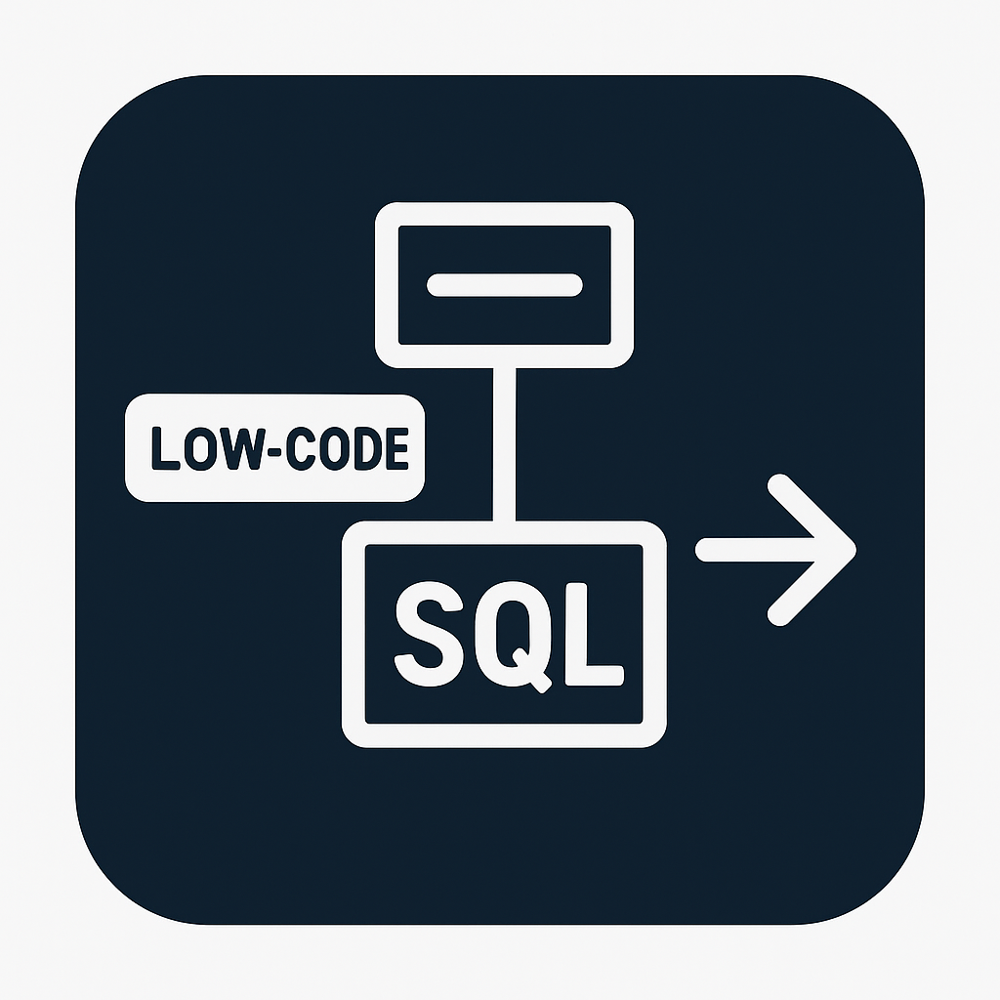

<a id="readme-top"></a>

<div align="center">
  <h3 align="center">SqlViewExtensions</h3>

  <p align="center">
    <a href="[https://github.com/othneildrew/Best-README-Template](https://github.com/SpaceExtensions/SpaceBPMSoftSqlViewExtensions)">
      
    </a>
    <h3 align="center">Решение для преобразования low-code фильтров в текст SQL запроса</h3>
    
    
  </p>
</div>


## О расширении
В BPMSoft одним из узких мест разработки является работа с базой данных, но мне как разработчику постоянно не хватает прозрачности в этом вопросе.
Множество мест системы, откуда могут вызываться запросы к базе данных сводится к постоянному мониторингу логов базы для анализа корректности запроса.
Особой проблемой являются бизнес-процессы, которые состоят из low-code фильтров, которые иногда довольно проблемно преобразовать в тот запрос, который формирует коробка.

Данное решение позволит увеличить прозрачность в этом вопросе и сделает доступным генерацию и просмотр SQL запросов из low-code фильтров.

## Дизайнер процессов


Для кубиков Чтения, Изменения и Удаления данных решение работает в расширенном режиме элемента на вкладках Запрос и План запроса.
Указанные в фильтрах константы попадают в запрос, а все ссылочные параметры представляются в виде значения по умолчанию: Guid.Empty, string.Empty и т.д.

## Roadmap
- [x] Генерация SQL по фильтрам элемента Чтение данных в дизайнере процессов
- [x] Генерация SQL по фильтрам элемента Изменение данных в дизайнере процессов
- [x] Генерация SQL по фильтрам элемента Удаление данных в дизайнере процессов
- [ ] Преобразование фронтового EntitySchemaQuery в SQL запрос
- [ ] Генерация SQL по фильтрам в разделах системы
- [ ] Генерация SQL по фильтрам в элементе Раздачи прав в дизайнере процессов

## Установка
* Перейти в раздел установка и удаление приложений
* Установить gz архив

## Установка в режиме работы с файловой системой
Разместить исходный пакет в директории Pkg и выполнить установку из файловой системы.

## Ручная сборка пакета
* Скачать Utilities of BPMSoft (UBS) или получить от вендора
* Воспользоваться командой zip на исходном пакете
  ```
  ubs zip SpaceBPMSoftSqlViewExtensionsPath
  ```

<!-- LICENSE -->
## Лицензия

Distributed under the Unlicense License. See `LICENSE` for more information.

## Контакты

Константин Харитонов - [@SpacePurr](https://t.me/SpacePurr)
